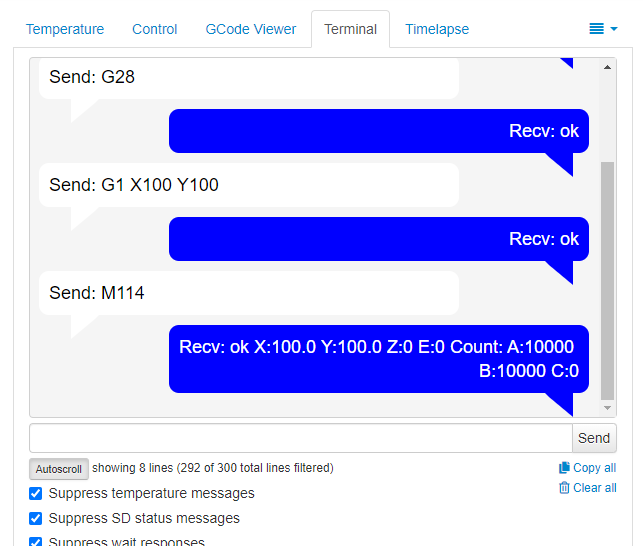

# Terminal Messaging

This plugin simply adjust the terminal output to look like a text message dialog using chat bubbles.

## Setup

Install manually using this URL in Plugin Manager > Get More > ...from URL:

    https://github.com/jneilliii/OctoPrint-TerminalMessaging/archive/master.zip

